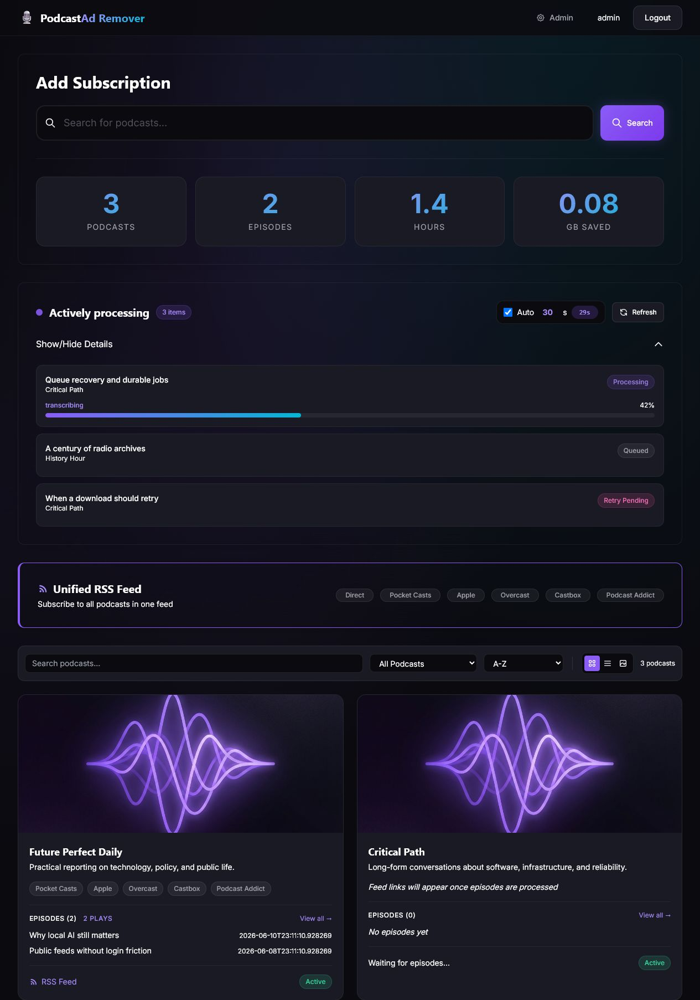
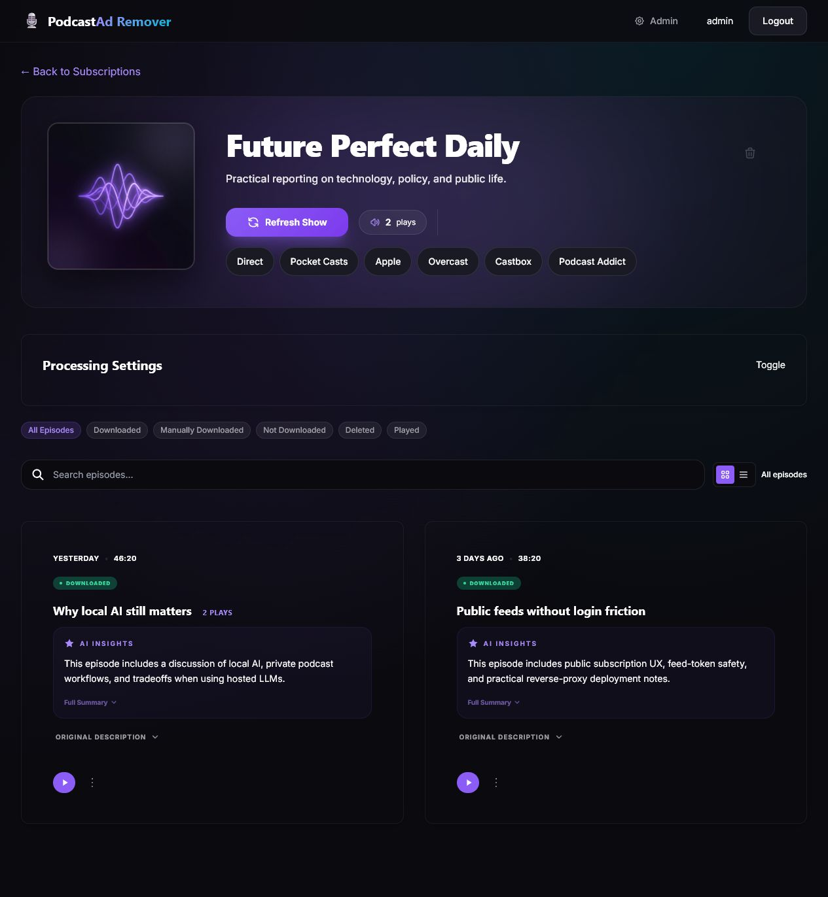
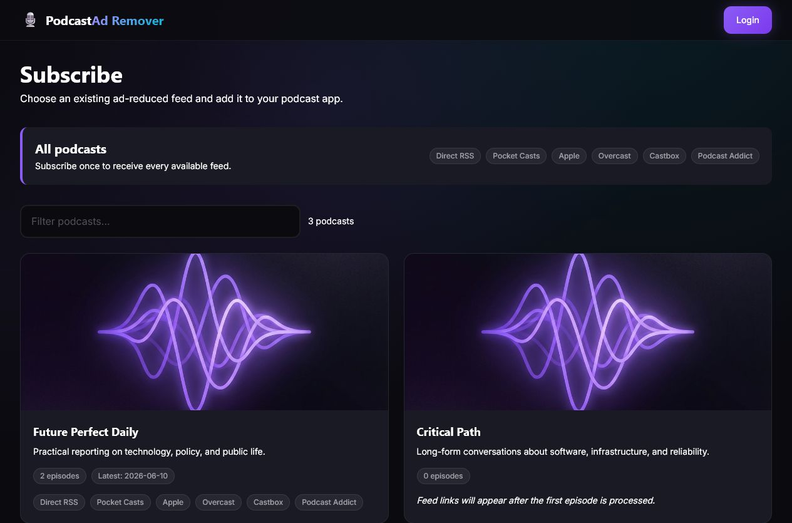
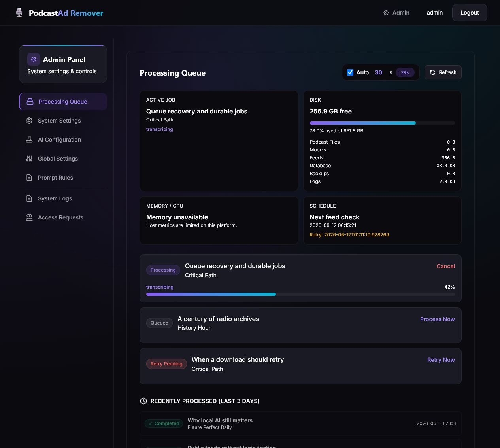

# Podcast Ad Remover

Podcast Ad Remover is a self-hosted app for downloading podcast episodes, removing ad and promo segments, and publishing replacement RSS feeds that can be subscribed to from a normal podcast client.

It is built for homelab-style deployment: one Docker container, SQLite state under `/data`, local transcription with Whisper/faster-whisper, FFmpeg audio editing, and LLM-backed ad detection through Gemini, OpenAI, Anthropic, or OpenRouter.

## Current UI

### Dashboard

The dashboard shows My Podcasts or the global Library, processing state, unified feed links, saved storage, and per-podcast feed links.



### Episode Management

Episode pages expose reprocessing, manual downloads, ignore/delete actions, AI summaries, descriptions, playback, and podcast-client subscription links.



### Public Subscribe Page

The optional `/subscribe` page is read-only and designed for people who only need to subscribe to existing feeds. It does not allow adding, editing, reprocessing, or deleting podcasts.



### Operations Dashboard

The admin queue shows active jobs, queued/retry states, disk usage, next feed checks, and recently processed items.



## Features

- Podcast search and RSS subscription management.
- Global podcast library with per-user My Podcasts lists and one shared copy of each podcast.
- In-place Library starring plus grid, artwork, and compact table views.
- Podcast ownership rules for per-podcast settings, with admin owner reassignment and admin-only global deletion.
- Grouped global-setting inheritance for content removal, retention, default features, and custom instructions.
- Permission-checked bulk editing for podcast settings and ownership.
- Optional ad-free badge composited onto generated podcast artwork.
- Automatic episode download and retention controls.
- Local transcription with Whisper/faster-whisper.
- LLM-based ad, promo, intro, and outro detection.
- FFmpeg-based audio cutting and rewritten RSS feed generation.
- Per-podcast feeds plus a unified feed.
- Optional AI episode summaries and spoken title intros using either local Piper TTS or Gemini TTS.
- Durable SQLite-backed processing jobs with retry and rate-limit states.
- Admin queue/operations dashboard.
- Optional token-protected AI/automation REST API with scoped tokens and configurable rate limits.
- Optional management login.
- Optional feed/audio authentication with generated feed tokens.
- Optional public read-only subscribe page for frictionless podcast-client setup.
- Optional Apprise-backed admin notifications for access requests, new podcasts, completed episodes, and breaking processing errors.
- Resource controls for Whisper CPU threads, FFmpeg threads, and unloading Whisper after jobs.

## Quick Start

### Docker Run

Run the published image and mount `/data` somewhere persistent:

```bash
docker run -d \
  --name podcast-ad-remover \
  -p 8000:8000 \
  -v ./data:/data \
  -e SESSION_SECRET_KEY="$(openssl rand -hex 32)" \
  -e BASE_URL="http://localhost:8000" \
  -e GEMINI_API_KEY="your_api_key" \
  jdcb4/podcast-ad-remover:latest
```

Open `http://localhost:8000`, then go to **Admin > AI Settings > Text Analysis** to confirm your provider and model settings.

Keep `SESSION_SECRET_KEY` stable once set. Changing it can invalidate browser sessions and signed feed tokens.

### Docker Compose

For local development from source:

```bash
cp env.example .env
docker compose up -d --build
```

For a production-style compose file using the published image, see `docker-compose.prod.yml` and [Documentation/Deployment.md](Documentation/Deployment.md).

### Unraid

A dedicated Unraid template is included at `Documentation/unraid/podcast-ad-remover.xml`. See [Documentation/Unraid_Deployment.md](Documentation/Unraid_Deployment.md).

## AI Providers

Gemini is the recommended default for most personal installs because the free tier is usually enough for this app's transcript-analysis workload. Gemini direct access uses Google's OpenAI-compatible endpoint through the OpenAI Python SDK.

The default Gemini cascade is:

1. `gemini-3.5-flash`
2. `gemini-3-flash`
3. `gemini-3.1-flash-lite`
4. `gemini-2.5-flash`
5. `gemini-2.5-flash-lite`

The app tries each configured model in order and falls back when a model is unavailable, fails, or hits a rate limit. OpenRouter uses the same order with `google/` model IDs.

Admins can also select **Custom OpenAI-compatible / Local** and provide an explicit API base URL plus
arbitrary model slug for Ollama, LocalAI, vLLM, or another compatible service. This is opt-in: Gemini
and the existing cloud cascades remain the defaults, and saved OpenAI cloud credentials are never
forwarded to a custom endpoint.

Current Gemini free-tier limits recorded for these defaults:

| Model | Category | RPM | TPM | RPD |
|-------|----------|-----|-----|-----|
| Gemini 2.5 Flash | Text-out models | 5 | 250K | 20 |
| Gemini 3 Flash | Text-out models | 5 | 250K | 20 |
| Gemini 2.5 Flash Lite | Text-out models | 10 | 250K | 20 |
| Gemini 3.1 Flash Lite | Text-out models | 15 | 250K | 500 |
| Gemini 3.5 Flash | Text-out models | 5 | 250K | 20 |

You can set keys in the Admin UI or with environment variables:

- `GEMINI_API_KEY`
- `OPENAI_API_KEY`
- `ANTHROPIC_API_KEY`
- `OPENROUTER_API_KEY`

Custom endpoint credentials are configured only in the Admin UI and may be left blank for keyless
local servers.

## Transcription

The app uses Faster-Whisper for transcription by default. Admins can switch to WhisperX from **Admin > AI Settings > Text Analysis**.

WhisperX can provide more accurate results, as the transcription process also includes speaker diarization and speaker segmentation.  These features include speaker identification and speaker-specific timestamps for each segment of the audio, which can better guide the AI during Ad Detection.  However enabling WhisperX with speaker diarization significantly increases the transcription time, and will also result in a larger transcription output size, which in turn will result in the Ad Detection process using more tokens.

It is recommended that for best results when enabling WhisperX, you also update the Ad Detection prompt to include information for the AI about the speaker diarization.  This will result in much better results than using the default prompt.

Sample WhisperX prompt:
``` Sample WhisperX prompt
You are a highly precise Podcast Structural Auditor. Your task is to segment a podcast transcript into exactly four functional categories: 'Intro', 'Promos', 'Ads', and 'Outro'.

Targets: {targets}
{custom_instr}

The transcript provided contains timestamps, speaker identification tags (e.g., SPEAKER_01, SPEAKER_02), and the spoken text.

CATEGORY DEFINITIONS & SPEAKER CUES:
Intro: The opening sequence. Includes greetings, host introductions, show names, and the initial setup of the episode's topic.
Speaker Cues: Look for a dedicated announcer who only speaks at the very beginning/end, or the primary host(s) establishing the dialogue.

Promos: Host-led self-promotions. This includes announcements regarding upcoming tours, live show dates, appearances, or mentions of the hosts' personal upcoming projects/tours.
Speaker Cues: Often delivered as a monologue by a single host, temporarily breaking the natural conversational back-and-forth between hosts.

Ads: Mid-roll transitions or breaks. This includes segments where the host explicitly signals a break (e.g., "let's take a break") or where the natural conversational flow is interrupted by a production transition. This also includes different speakers which are not the hosts of the podcast talking about another podcast, or some product.
Speaker Cues: Look for a sudden shift from dialogue to a long, continuous block of text by one speaker. Also, look out for a brand-new speaker tag appearing in the middle of the transcript, which usually indicates an external ad-read or network announcer.  Ads can happen at any time during the transcript, including right at the start and at the end.  Look for short segments (30-60 seconds) with speakers who are not the hosts, talking about a podcast.  Sometimes an Ad for a podcast will end with something like "or wherever you get your podcast".

Outro: The closing sequence. Includes the final sign-off, production credits (e.g., "A production of..."), and platform-specific calls to action.
Speaker Cues: Look for the conversation ending, transitioning back to a single host monologue, or the return of the introductory announcer.

### SEGMENTATION RULES:
- **Strict Temporal Continuity**: Ensure the end time of one segment is the start time of the next.
- **Contextual Awareness**: Distinguish between "Content" (talking about the topic) and "Promo" (talking about the hosts' business/tours).
- **Silence/Gap Rule**: If there is a significant jump in timestamps or a break in the dialogue flow that suggests a commercial break, label it as **Ad**.

INSTRUCTIONS:
Analyze the conversational flow, semantic markers, AND speaker patterns to identify the exact start and end timestamps for each segment.

Use speaker changes as hard boundary markers. Segments typically start and end precisely when the speaker changes.

Ensure that "Promos" are distinguished from "Intro" by focusing on the distinction between "Welcome to the show" (Intro) vs. "We are touring/performing at [Location]" (Promo).

Ensure that "Ads" captures the transition/break period, even if the segment contains no spoken commercial dialogue.

### OUTPUT FORMAT:
Return ONLY a JSON array of objects with "reason", "start", "end", and "label" (Ad/Promo/Intro/Outro). Do not include markdown formatting or introductory text outside the JSON block. Give a short concise reason as to why the segment was labelled the way it was.

### EXAMPLE OUTPUT:
[
  {
    {"reason": "Intro discussion by hosts", "start": 0.0, "end": 5.0, "label": "Intro"}
  },
  {
    {"reason": "Hosts were promoting their tour of Australia","start": 15.0, "end": 30.0, "label": "Promo"}
  },
  {
    {"reason": "Advertisement promoting the Joy101 Podcast", "start": 45.0, "end": 50.0, "label": "Ad"}
  },
  {
    {"reason": "Hosts were signing off", "start": 60.0, "end": 65.0, "label": "Outro"}
  },
]
```

## Text-To-Speech

Piper remains the default TTS provider because it is local and does not consume API quota. Admins can optionally switch spoken title intros and audio summaries to Gemini TTS from **Admin > AI Settings > Voice and TTS**.

Gemini TTS uses the saved Gemini API keys and this default fallback order:

1. `gemini-3.1-flash-tts-preview`
2. `gemini-2.5-flash-preview-tts`

Available Gemini voices are `Orus` (default), `Enceladus`, and `Laomedeia`. Current free-tier limits recorded for each Gemini TTS model are 3 RPM, 10K TPM, and 10 RPD.

## Authentication And Feed Access

The app supports separate choices for management access and podcast feed access:

- Management pages can require login.
- The public `/subscribe` page can remain available without login.
- Feeds and audio can remain unauthenticated for the smoothest podcast-client setup.
- Feed/audio authentication can be enabled when you want clients to use credentials or generated feed-token URLs.

Protected feed URLs containing `token=` are bearer secrets. Anyone with the full URL can read that feed and download audio until the token is revoked.

## AI API

Admins can enable an optional REST API under `/api/v1` from **Admin > System Settings**. API clients use separate `par_...` bearer tokens with scoped access (`read`, `write`, `process`, `admin`) and SQLite-backed per-token/IP rate limits. See [Documentation/API.md](Documentation/API.md).

## Admin Notifications

Notifications are off by default. Admins can enable them from **Admin > Notifications** by adding one or more Apprise URLs and selecting which events should send alerts.

Initial supported events are:

- user access requested
- new podcast added to the global library
- episode processed and available in feeds
- breaking processing errors, including max-retry failures and top-level worker errors

Apprise supports many targets, including ntfy, Gotify, Pushover, Discord, Telegram, Slack, email/SMTP, webhooks, and SMS providers. Treat notification URLs as secrets because many contain tokens or webhook credentials.

## Persistent Data

Mount `/data` in Docker. It contains:

- `/data/db/podcasts.db`
- `/data/podcasts/`
- `/data/feeds/`
- `/data/artwork/`
- `/data/models/`
- `/data/backups/`
- logs

Database migrations are designed to preserve existing installs. Formal migrations create backups under `/data/backups/` before applying schema changes.

New podcasts inherit all four global setting groups. Upgraded podcasts keep their existing explicit
content-removal, retention, and feature values; only podcasts whose custom instructions were blank or
NULL begin inheriting global custom instructions. The stored podcast values are retained while a group
inherits, so disabling inheritance restores the podcast's previous overrides.

## Verification

Before completing code changes:

```bash
npm run verify
```

For Docker/release work:

```bash
npm run verify:docker
```

Experimental branch images can be published without touching `latest`:

```bash
npm run docker:experimental -- --push --tag experimental
```

Experimental Apple Silicon / ARM64 images can be built without Piper TTS:

```bash
npm run docker:experimental:arm64 -- --push
```

`linux/amd64` remains the primary release target. The ARM64 experimental image skips Piper because its phonemizer dependency is not currently available as a simple Linux arm64 wheel. Podcast download, local transcription, ad detection, cutting, feeds, and the web UI remain the target feature set. Spoken summaries and title intros can still be tested on no-Piper images by selecting Gemini TTS and configuring a Gemini API key.

Release publishing is explicit and tags both the version and `latest`:

```bash
npm run docker:publish
```

## Documentation

- [Project Index](Documentation/PROJECT_INDEX.md)
- [AI API](Documentation/API.md)
- [Architecture](Documentation/Architecture.md)
- [Deployment](Documentation/Deployment.md)
- [Environment Variables](Documentation/Environment_Variables.md)
- [Verification](Documentation/VERIFICATION.md)
- [Versioning](Documentation/VERSIONING.md)
- [Changelog](Documentation/CHANGELOG.md)
- [Decisions](Documentation/DECISIONS.md)
- [Resource Audit](Documentation/RESOURCE_AUDIT.md)
- [Local LLM Evaluation](Documentation/LOCAL_LLM_EVALUATION.md)
- [Local LLM HTML Comparison Report](Documentation/LOCAL_LLM_EVALUATION_REPORT.html)
- [Roadmap](Documentation/ROADMAP.md)
- [Naming](Documentation/NAMING.md)
- [Security](SECURITY.md)

## License

MIT License
